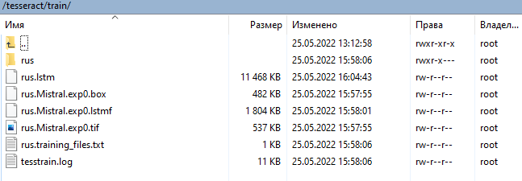

# Добавление шрифтов

## Вступление

По умолчанию `tesseract` поддерживает следующие шрифты для русского языка:

* Arial Bold
* Arial Bold Italic
* Arial Italic
* Arial
* Courier New Bold
* Courier New Bold Italic
* Courier New Italic
* Courier New
* Times New Roman, Bold
* Times New Roman, Bold Italic
* Times New Roman, Italic
* Times New Roman
* Georgia Bold
* Georgia Italic
* Georgia
* Georgia Bold Italic
* Trebuchet MS Bold
* Trebuchet MS Bold Italic
* Trebuchet MS Italic
* Trebuchet MS
* Verdana Bold
* Verdana Italic
* Verdana
* Verdana Bold Italic
* DejaVu Serif
* DejaVu Serif Oblique
* DejaVu Serif Bold
* DejaVu Serif Bold Oblique
* Lucida Bright
* FreeSerif Bold
* FreeSerif Bold Italic
* DejaVu Sans Ultra-Light

Tesseract распознает документы с другими шрифтами, если они близки по написанию. Если результаты OCR неудовлетворительные, необходимо в первую очередь обратить внимание на качество документов. Изучите информацию о способах [улучшения качества изображения](https://github.com/tesseract-ocr/tessdoc/blob/main/ImproveQuality.md) прежде чем приступать к обучению.

Обучение `tesseract` выполнялось в ОС "CentOS Linux Version 8".

## Системные требования

1. Python не ниже 3.\* версии
2. Система управления пакетами pip
3. Установленные пакеты для `python`

```text
Pillow>=6.2.1
python-bidi>=0.4
matplotlib
pandas
```

[requirements.txt](./readme_files/requirements.txt)

4. Установленные библиотеки разработчика

```bash
yum groupinstall "Development Tools"
```

5. Установленный `tesseract`, версия не ниже 4.0

```bash
yum install tesseract
```

## Подготовка рабочего пространства

1. Создайте директорию для работы

```bash
mkdir /tesseract
cd /tesseract
```

2. Загрузите `langdata`

```bash
git clone https://github.com/tesseract-ocr/langdata_lstm.git
```

3. Загрузите `tessdata`

```bash
git clone https://github.com/tesseract-ocr/tessdata_best.git
```

или

```bash
git clone https://github.com/tesseract-ocr/tessdata_fast.git
```

3. Загрузите `tesstrain`

```bash
git clone https://github.com/tesseract-ocr/tesstrain.git
```

4. Создайте директорию fonts и скопируйте в нее необходимые шрифты

```bash
mkdir fonts
```

В нашем случае мы будем добавлять шрифт [MISTRAL.TTF](./readme_files/MISTRAL.TTF).
5\. Создайте директорию `tmp` для временных файлов.

```bash
mkdir tmp
```

6. Создайте директорию `train`.

```bash
mkdir train
```

7. Создайте директорию `output`.

```bash
mkdir output
```

8. Создайте директорию `scripts`.

```bash
mkdir scripts
```

Скопируйте в директорию скрипты:

* [generate_training_data.sh](./readme_files/generate_training_data.sh)
* [extract_lstm.sh](./readme_files/extract_lstm.sh)
* [finetune.sh](./readme_files/finetune.sh)
* [eval.sh](./readme_files/eval.sh)
* [combine.sh](./readme_files/combine.sh)

## Создание набора данных для обучения

1. Перейдите в директорию `scripts`

```bash
cd scripts
```

2. Сгенерируйте данные для обучения. Установите необходимое количество генерируемых страниц. В данном примере количество страниц равно 100.

```bash
./generate_training_data.sh
```

4. Извлеките модель `rus.lstm` из файла `rus.traineddata`

```bash
./extract_lstm.sh
```

5. В директории `train` должны появиться следующие файлы:
   

## Обучение

1. Запустите обучение. Установите необходимое количество итераций. В данном примере установлено15000 итераций.

```bash
./finetune.sh
```

2. Проверьте полученную модель.

```bash
./eval.sh
```

Обратите внимание на качество распознавания:

```text
At iteration 0, stage 0, Eval Char error rate=0.12250957, Word error rate=0.51918531
```

3. Объедините полученную модель с существующей моделью. Данную операцию можно выполнять в процессе обучения. В этом случае для объединения будет автоматически выбран последний файл \`pubg\*.checkpoint\`.

```bash
./combine.sh
```

В директории 'output' будет создан файл 'pubg.traineddata'. Его мы будем использовать для тестирования результата, изменив название на 'rus.traineddata'.

## Тестирование

1. Выполним распознавание тестового файла:

* [Исходный файл](./readme_files/source_im.pdf)
* [OCR до обучения](./readme_files/ocr_before_training.txt)
* [OCR после обучения](./readme_files/ocr_after_training.txt)

## Примечание

1. При добавлении нового шрифта и объедении новой модели со старой нужно учитывать, что качество распознавания других шрифтом может ухудшится или, по крайней мере, измениться:

* [Исходный файл](./readme_files/2.jpg)
* [До обучения](./readme_files/2.txt)
* [После обучения](./readme_files/2_after_training.txt)

| До обучения | После обучения |
| --- | --- |
| пришли к следующему соглашению: | **припли** к следующему соглашению: |
| другая Договаривающеяся Сторон | другая **Договариваюцаяся** Сторона |
| информировать друг друга | **ин4ормировать** друг друга о вопросах |
